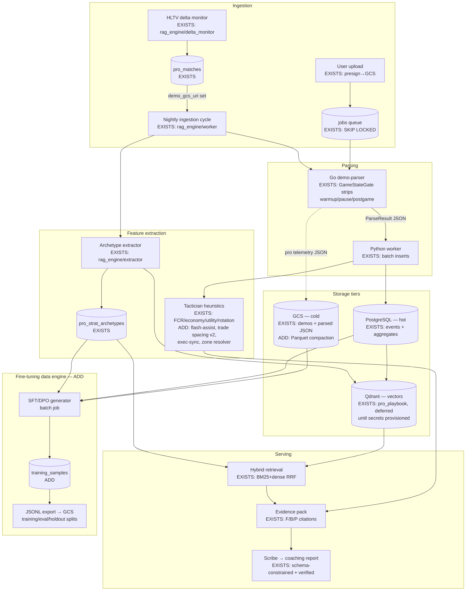

# Data Architecture & Fine-Tuning Data Engine — Design Document

Blueprint for the hybrid database backend, feature-extraction pipeline, and LLM
fine-tuning data engine. **Grounding rule:** every section states what already
EXISTS in this repo versus what this blueprint ADDS, so implementation is a
diff, not a rewrite. Shipped decisions (TECHNICAL_SPEC §15) are reconciled
deliberately where this prompt's letter diverges — deviations are listed in §7.

Reasoning summary (per protocol):
- **Granularity:** sub-tick precision is kept only for *events* (kills,
  damages, utility detonations) where ordering decides trades and flash
  assists; positions stay at 2s sampling (trajectories); everything the LLM or
  dashboards consume is round-level aggregates. Tick streams never enter
  Postgres row-per-tick — that is what bloats these systems.
- **Vector chunking:** multi-agent spatial tactics are embedded as *canonical
  narrative summaries* — zone names + phase timings ("smoke CT+Jungle at 0:12,
  entry Ramp 0:15, trade window 3s") — never raw coordinates. Sequential
  context survives as ordered phase clauses inside one chunk; one archetype =
  one chunk = one vector, with strict payload filters carrying the categorical
  axes.
- **Hot/cold:** Postgres holds aggregates + recent event detail (hot); parsed
  event streams live in GCS as JSON→Parquet (cold, replayable); raw `.dem`
  files age out by lifecycle rule. Fine-tuning datasets are built from cold
  storage by batch jobs, never from the hot path.

---

## 1. System Architecture & Data Flow



Consistency boundaries: **Postgres is the source of truth** for all relational
facts; Qdrant is a derived index (rebuildable from `pro_strat_archetypes` — the
`qdrant_point_id` column already records the linkage); GCS is immutable
append-only. Anything in Qdrant or GCS can be regenerated from Postgres + raw
demos, which is what makes the vector layer safely optional (current state).

## 2. Relational Schema (delta over the existing schema)

EXISTS (unchanged): `matches, kills, grenades, rounds, first_contacts,
trajectories, teams, team_members, jobs, sync_outbox, subscriptions,
pro_tournaments, pro_matches, pro_rounds, pro_strat_archetypes, pro_baselines,
strats, strat_revisions`. All already carry FKs, tenant columns
(`user_id`/`team_id`), and the access-check pattern in the API layer.

ADD (DDL sketch — becomes Alembic revisions when implemented):

```sql
-- Canonical callout zones: the coordinate→language bridge (constraint: no raw
-- coords in LLM context). Seeded from the extractor's per-map zone tables,
-- then curated. One row per (map, zone).
CREATE TABLE map_zones (
    id           SERIAL PRIMARY KEY,
    map_name     VARCHAR(64) NOT NULL,
    zone_key     VARCHAR(64) NOT NULL,   -- 'Inferno_Banana_Car'
    display_name VARCHAR(64) NOT NULL,   -- 'Banana Car'
    min_x REAL NOT NULL, min_y REAL NOT NULL,
    max_x REAL NOT NULL, max_y REAL NOT NULL,
    z_floor REAL NULL,                    -- disambiguates Nuke A/B verticality
    UNIQUE (map_name, zone_key)
);
CREATE INDEX ON map_zones (map_name);

-- Damage events: needed for utility effectiveness (HE/molly damage) and
-- crosshair-placement proxies. Parser addition (see §4); sub-tick kept as
-- (tick, subtick_offset) — ordering matters for trades.
CREATE TABLE damages (
    id BIGINT GENERATED ALWAYS AS IDENTITY,
    match_id VARCHAR(36) NOT NULL REFERENCES matches(match_id) ON DELETE CASCADE,
    round_num INT NOT NULL,
    tick BIGINT NOT NULL,
    subtick_offset REAL NULL,
    attacker_steamid VARCHAR(32), victim_steamid VARCHAR(32),
    weapon VARCHAR(32) NOT NULL DEFAULT '',
    hp INT NOT NULL, armor INT NOT NULL DEFAULT 0,
    hitgroup VARCHAR(16) NOT NULL DEFAULT '',   -- head/chest/... (placement proxy)
    is_utility BOOLEAN NOT NULL DEFAULT FALSE,
    PRIMARY KEY (match_id, id)
) PARTITION BY HASH (match_id);   -- 16 partitions; see §5

-- Flash effectiveness: per flash detonation, who was blinded and for how long.
CREATE TABLE flash_events (
    id BIGINT GENERATED ALWAYS AS IDENTITY,
    match_id VARCHAR(36) NOT NULL REFERENCES matches(match_id) ON DELETE CASCADE,
    round_num INT NOT NULL,
    tick BIGINT NOT NULL,
    thrower_steamid VARCHAR(32),
    blinded_steamid VARCHAR(32),
    blind_duration REAL NOT NULL,          -- seconds
    is_teammate BOOLEAN NOT NULL DEFAULT FALSE,  -- team-flash tracking
    PRIMARY KEY (match_id, id)
) PARTITION BY HASH (match_id);

-- Round-level tactical aggregates: what dashboards/benchmarks read, so the
-- hot path never scans event partitions. Written by the extraction pass.
CREATE TABLE round_features (
    match_id VARCHAR(36) NOT NULL REFERENCES matches(match_id) ON DELETE CASCADE,
    round_num INT NOT NULL,
    side_focus VARCHAR(4) NOT NULL,               -- CT | T (one row per side)
    opening_duel_won BOOLEAN, opening_zone VARCHAR(64), opening_flash_assist BOOLEAN,
    util_damage INT NOT NULL DEFAULT 0,
    enemy_blind_seconds REAL NOT NULL DEFAULT 0,
    team_blind_seconds REAL NOT NULL DEFAULT 0,
    smoke_coverage_score REAL NULL,               -- §4.2
    trade_success_rate REAL NULL, avg_trade_window_s REAL NULL,
    exec_sync_score REAL NULL,                    -- §4.4
    archetype_label VARCHAR(128) NULL,
    PRIMARY KEY (match_id, round_num, side_focus)
);

-- Fine-tuning samples (§5). Tenancy note: pro-derived rows have NULL
-- source_user; amateur-derived rows keep the source for consent/erasure
-- tracking but are exported fully anonymized.
CREATE TABLE training_samples (
    id BIGINT GENERATED ALWAYS AS IDENTITY PRIMARY KEY,
    kind VARCHAR(8) NOT NULL CHECK (kind IN ('sft', 'dpo', 'eval')),
    map_name VARCHAR(64) NOT NULL, side VARCHAR(4) NOT NULL,
    buy_type VARCHAR(16) NOT NULL, round_type VARCHAR(16) NOT NULL,
    patch_version VARCHAR(16) NOT NULL DEFAULT '',
    situation_json TEXT NOT NULL,        -- zone-abstracted, §5
    chosen_json TEXT NOT NULL,           -- SFT target / DPO chosen
    rejected_json TEXT NULL,             -- DPO only
    provenance_json TEXT NOT NULL,       -- pro_match_id/round refs OR user match (anonymized)
    source_user VARCHAR(64) NULL,        -- erasure hook; never exported
    split VARCHAR(8) NOT NULL DEFAULT 'train' CHECK (split IN ('train','eval','holdout')),
    quality_score REAL NULL,             -- LLM-judge gate, §5.3
    created_at TIMESTAMP NOT NULL DEFAULT now()
);
CREATE INDEX ON training_samples (kind, split);
CREATE INDEX ON training_samples (map_name, side, buy_type);
```

**TimescaleDB — deliberately not adopted** (deviation, §7): the write pattern
is bulk-insert-once-per-match, not continuous time-series append, and reads go
through `round_features`. Native hash partitioning on `match_id` gives the
pruning we need without a new extension on Cloud SQL.

## 3. Vector Layer — Embedding & Filtering Strategy

EXISTS: Qdrant collection `pro_playbook` (768-dim Gemini embeddings), payload
filters `{map, side, buy_type, team_name, round_type, patch_version,
pro_match_id, scope}`, uuid5 point ids stored on `pro_strat_archetypes`,
hybrid BM25+dense retrieval with RRF fusion, LOCAL_MODE/BM25-only degradation.

ADD:
- **Chunking rule (formalized):** one archetype = one chunk. The embedded text
  is the canonical narrative: `"{map} {side} {label}: phase 1 — {utility
  sequence with zone names + t offsets}; phase 2 — {entry zones, trade
  spacing}; outcome — {win rate, n rounds}"`. Timing lives in the prose
  (ordinal + seconds), so sequence context survives embedding without
  coordinate leakage. Multi-round *sequences* (e.g., a team's A-B-A fake
  pattern across rounds) become their own `sequence` chunks referencing member
  archetypes in payload `member_ids`.
- **Second collection `round_situations`** (for SFT retrieval-augmentation and
  "find rounds like mine"): one point per notable pro round, embedding the
  §5 situation text, payload `{map, side, buy_type, round_type, outcome,
  pro_match_id, round_num, patch_version}`.
- **Patch versioning:** `patch_version` is a mandatory payload filter axis;
  retrieval defaults to the current patch with fallback to `any` — meta from
  old patches must be opt-in, not ambient.
- Rebuild story: both collections regenerate from Postgres; a
  `scripts/rebuild_vectors.py` batch walks `pro_strat_archetypes` +
  `training_samples(kind='eval')` — Qdrant remains disposable.

## 4. Telemetry → Tactics Feature Extraction

EXISTS: tactician modules (FCR, economy coherence, utility sequencing,
rotation efficiency), archetype extractor (zone inference from coordinate
clusters, execute/split/default classification, buy typing, trade success
within 5s/600u, utility lead time). ADD four upgrades, all consuming the new
event tables:

1. **Zone resolver (shared library):** `resolve_zone(map, x, y, z?) →
   zone_key` backed by `map_zones` (bounding boxes + z floor). Replaces the
   extractor's inline zone tables; used by every feature below and by the
   evidence pack so *all* LLM-visible text speaks in callouts
   (`Inferno_Banana_Car`), satisfying the no-raw-coordinates constraint.
2. **Opening duels v2:** first_contact ± flash context — a duel is
   `flash_assisted` when a `flash_events` row blinds the victim ≥0.7s within
   1.5s before the kill tick; records `opening_zone` for both parties, timing
   offset from round start (freezetime-corrected via GameStateGate's canonical
   rounds).
3. **Utility effectiveness:** blind seconds per flash (enemy vs team-flash),
   HE/molly damage from `damages(is_utility)`, and `smoke_coverage_score` —
   fraction of the executed-site's choke zones (from `map_zones` choke tags)
   covered by smoke detonations in the 10s pre-entry window.
4. **Trade spacing v2 + execution sync:** trade windows recorded as *(Δt,
   Δdistance)* pairs per death (not just the 5s boolean), aggregated to
   `avg_trade_window_s`; `exec_sync_score` = 1 − normalized spread between
   last utility detonation and first site entry across the executing players
   (simultaneity metric pros optimize).

**Parser additions required** (Go, additive events): `PlayerHurt` →
`damages` (hitgroup gives the crosshair-placement proxy), `PlayerFlashed` →
`flash_events`, grenade detonate ticks (the model exists; `detonate_tick` is
unpopulated). All flow through GameStateGate like every other event.

## 5. SFT & DPO Dataset Generation

The engine converts pro telemetry into instruction pairs. Batch job
(`services/finetune_engine/`, nightly after ingestion), writing
`training_samples`, exporting JSONL to `gs://…/training/{kind}/{split}/`.

### 5.1 SFT — `[Situation] → [Pro reasoning + decision]`

Situation text is **zone-abstracted telemetry** (constraint honored) rendered
from `round_features` + `pro_rounds`; the target combines the deterministic
outcome with LLM-drafted analyst reasoning that is **verified against the
telemetry** by the same verification pattern the Scribe uses (unsupported
drafts are discarded — the grounding discipline transfers to training data).

```json
{
  "kind": "sft",
  "messages": [
    {"role": "system", "content": "You are a tier-1 CS2 analyst. Reason from the telemetry only."},
    {"role": "user", "content": "Map: de_inferno, T side, round 14 (T lead 7-6), full buy vs full buy, patch 1.41.\nState at 0:35: 5v5. Utility available: 2 smokes, 3 flashes, 1 molly.\nT positions: 3x Inferno_TRamp, 1x Inferno_Banana_Car (lurk), 1x Inferno_Second_Mid.\nPrior rounds: CT stacked B on 12 and 13 (3 anchors Inferno_BSite_NewBox).\nWhat is the correct call and execution sequence?"},
    {"role": "assistant", "content": "CT has committed to B stacks two rounds running, so A is under-defended... Call: A execute through apps+short. Sequence: smoke Inferno_A_Library and Inferno_A_Arch at 0:40, flash over Inferno_A_Balcony at 0:43, entry apps pair at 0:44 with trade spacing under 300 units, lurker holds Banana for the rotate cut. Molly Inferno_A_Pit on site take."}
  ],
  "provenance": {"pro_match_id": "hltv-2377810", "round": 14, "teams": "Vitality vs FaZe", "outcome": "T win, 2 traded entries"},
  "filters": {"map": "de_inferno", "side": "T", "buy_type": "full_buy", "round_type": "execute", "patch_version": "1.41"}
}
```

### 5.2 DPO — chosen (pro) vs rejected (amateur blunder)

**Grounded rejected-sample source (the platform's structural advantage):** we
hold real amateur telemetry. Rejected responses are synthesized from actual
amateur patterns in *matched situations* — same map/side/buy/round-type — found
via the situation vector collection: the amateur round that lost with a
heuristic-flagged blunder (dry entry, no-trade spacing, util dumped pre-contact)
becomes the rejected decision, described in the same voice. Amateur provenance
is anonymized at export (no ids, no names — `source_user` stays only in
Postgres for erasure).

```json
{
  "kind": "dpo",
  "prompt": "Map: de_mirage, CT side, 2v3 post-plant A, bomb Mirage_A_Default, 0:32 on clock, you hold Mirage_CT_Spawn + teammate Mirage_Jungle, 1 smoke 1 flash left. Plan the retake.",
  "chosen": "Wait for the 0:20 mark to force their utility first. Smoke Mirage_A_Ramp to cut the crossfire, flash over Mirage_Stairs, take Jungle→Site as a pair with sub-3s trade spacing, defuse behind the Mirage_A_Default box using the smoke as cover.",
  "rejected": "Push immediately from both angles before they set up — spawn player wide through Mirage_A_Palace side while Jungle holds, save the smoke in case the defuse gets contested.",
  "rejected_source": "amateur_pattern: uncoordinated 2-way retake, 71% loss rate in matched amateur rounds; utility unused on death",
  "filters": {"map": "de_mirage", "side": "CT", "buy_type": "full_buy", "round_type": "retake", "patch_version": "1.41"}
}
```

### 5.3 Quality gates & evaluation

- **Telemetry verification pass** (flash-tier LLM judge): does the reasoning
  cite only facts present in the situation? Drop rate logged — same grounding
  metric philosophy as serving.
- **Outcome filter:** SFT targets only from rounds the pro side *won* (or
  strategically sacrificed with documented intent via analyst desk data —
  future); DPO chosen requires win + clean heuristic scores.
- **Splits:** by `pro_match_id` (never by round — rounds within a match leak);
  `holdout` = entire most-recent tournament, giving a temporal eval set.
- **Eval harness:** `kind='eval'` samples replay through the *serving* Scribe
  to score the production system (citation coverage, verification drop-rate,
  decision agreement with pro play) — one dataset, two consumers.

## 6. HLTV Ingestion — Delta State Machine

EXISTS: `run_delta` dedupes on `hltv_match_id` PK; `ingested_at NULL` =
pending; parse stage gated on `demo_gcs_uri`; per-match rollback; backoff with
jitter + Retry-After; S/A-tier filter; fixture client. The implicit state
machine, made explicit (states live in existing columns — no schema change):

```
DISCOVERED  (row exists; demo_gcs_uri NULL, parsed NULL, ingested_at NULL)
    │ demo acquired (crawler/manual sets demo_gcs_uri)
AWAITING_PARSE ──parse ok──▶ PARSED (parsed_gcs_uri set)
    │ parse fail (zero live rounds → fails loudly)          │ extract+vectorize ok
    ▼                                                       ▼
FAILED (error logged; retried next cycle          INGESTED (ingested_at set;
        until demo replaced/removed)                        archetypes + vectors live)
```

Invariants: transitions are single-writer (the nightly cycle), idempotent
(re-running any stage is safe — `_persist_rounds` replaces, vector upserts are
uuid5-stable), and monotonic except FAILED→AWAITING_PARSE on retry. Zero
duplicate processing is guaranteed by the PK dedupe at DISCOVERED and the
`ingested_at` stamp at INGESTED. ADD: an `ingest_attempts` counter +
`last_error` on `pro_matches` (small migration) so permanently bad demos stop
retrying after N cycles, mirroring the jobs-table pattern.

## 7. Deviations from the prompt (deliberate, per CLAUDE.md)

| Prompt says | Decision | Why |
|---|---|---|
| TimescaleDB | Plain Postgres + hash partitions | Bulk-per-match writes, aggregate reads; no new extension on managed Cloud SQL |
| Pinecone as an option | Qdrant only (still deferred) | Third vector store adds nothing; BM25 leg carries retrieval until activation |
| S3/R2 | GCS | Whole platform is GCP; lifecycle rules cover cold tiering (demos → Nearline 30d → delete 180d; Parquet persists) |
| Sub-tick everywhere | Sub-tick for events only | Positions at 2s sampling already serve the viewer + heuristics; per-tick rows are the bloat this design exists to avoid |

## 8. Implementation order (when green-lit — this document is the blueprint)

1. `map_zones` + zone resolver, refactor extractor onto it (unlocks the
   no-coordinates constraint everywhere).
2. Parser events: PlayerHurt / PlayerFlashed / detonate ticks → `damages`,
   `flash_events` (+ migrations, partitioned).
3. Extraction v2: `round_features` writer (flash assists, blind seconds,
   smoke coverage, trade windows, exec sync) + new `pro_baselines` rows fed
   from pro `round_features` distributions.
4. `training_samples` + `services/finetune_engine` (SFT first, DPO second) +
   JSONL exporter + eval harness.
5. `ingest_attempts` migration; Parquet compaction job; GCS lifecycle rules.
